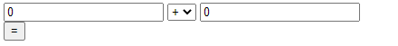

# Exercise

## What you will learn

* Use variables
* Use function
* Use if/else

## Instructions

### Exercise 1

The exercise is composed with an index.html file and calculus.js file.
When you open the index.html with your browser you will see:



By clicking on the equal button "0" will appear. Try changing the numbers, 0 always appear... Fix it!

In the file calculus.js fill the function ```compute``` by using what you learnt. Get a result for '+', '-', '/'
