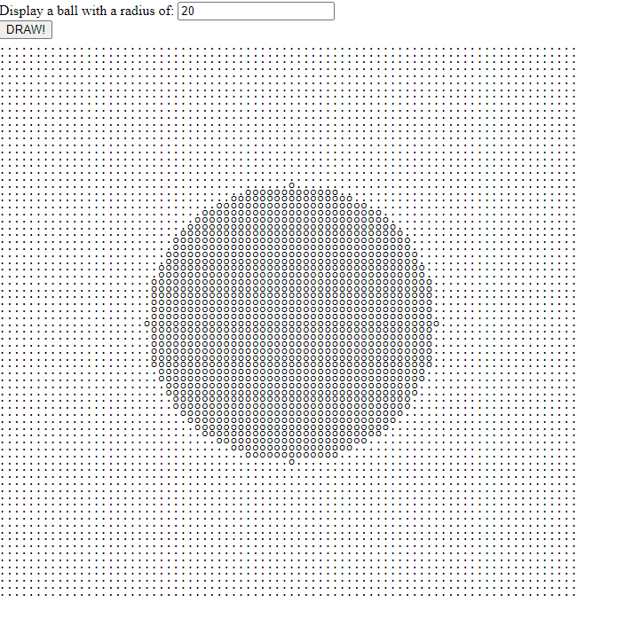
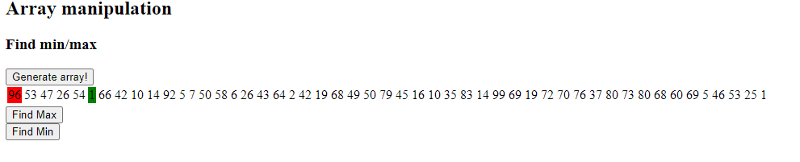

# Exercise

## What you will learn

* Use for
* Use array

## Instructions

### Exercise 1

Display a ball like in the image:

Go into [exercise 1](1/)

Complete fillShape.

### Exercise 2

Find the minimum and maximum of an array.

complete the findMin and findMax inside [index.js](2/index.js)

Go into [exercise 2](2/)

